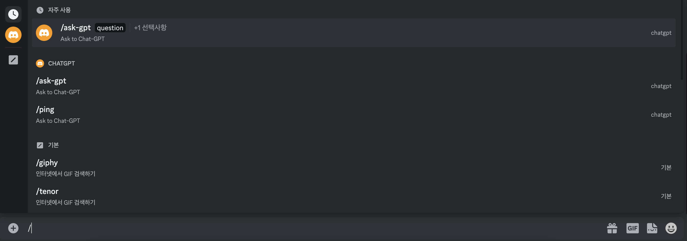
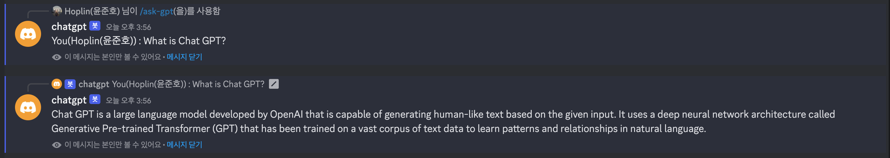
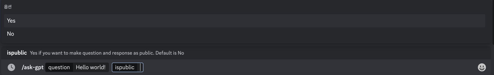

Chat-GPT discord command
===
## Prerequisite

### Installation 
- Docker
- Docker Compose

### API Keys(Environment Variables)
- DISCORD_API
    - Get discord bot token in [here](https://discord.com/developers/applications).
    - Create application and go to tab `Bot`
- APPLICATION_ID
    - Get discord bot token in [here](https://discord.com/developers/applications).
    - Create application and go to tab `General Information`
- GUILD_ID
    - Make sure your discord's developer mode in active
    - Make right click on Guild's icon and click `Copy ID`
- OPENAI_API
    - Get OpenAI API key in [here](https://platform.openai.com/docs/quickstart/build-your-application)
## Start Application
***

1. git clone project
    ```bash
    git clone https://github.com/J-hoplin1/ChatGPT-SlashCommand.git
    ```

2. Write down API Keys, in [docker-compose.yml](./docker-compose.yml), `environment` field
    ```yaml
    ...
    
    environment:
        - DISCORD_API=
        - APPLICATION_ID=
        - GUILD_ID=
        - OPENAI_API=
    
    ...
    ```

3. Run docker compose
    ```bash
    docker-compose up -d
    ```
## How to use command?
1. Press `/` button and you can see command `/ask-gpt`
    

2. When you use a command, you are the only one who can see the command and its answers.
    
3. If you want to make your command public add `ispulbic` option when using command
    